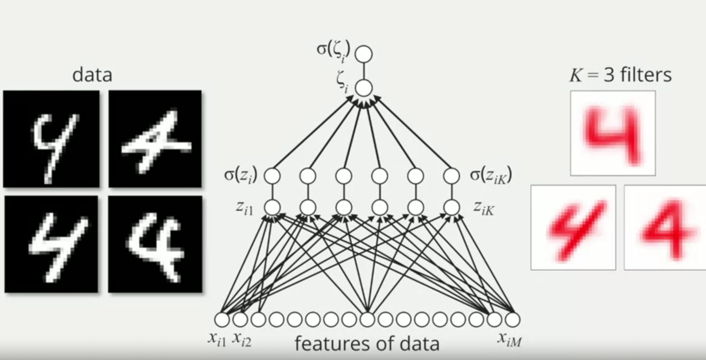
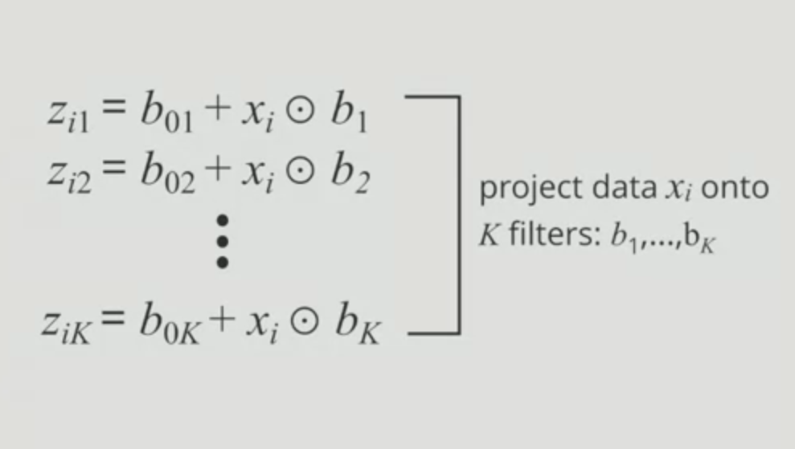
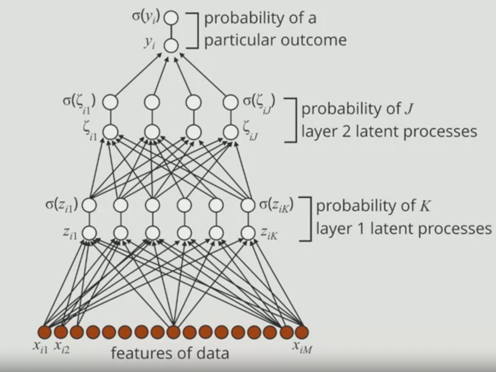

# Goals
1. Explain why machine learning is exciting.
Hal yang menarik dari machine learning adalah performanya dalam menyelesaikan suatu task yang semakin hari melampaui kemampuan manusia (misal dalam ImageNet Challenge, dan Game).
2. Recognize the characteristics of the logistic regression model.

## Concept
- Machine Learning : We want to teach a machine to learn. (Kita akan memberikan contoh, dalam hal ini adalah **data**)
- Linear Regression dapat dijadikan contoh yang bagus dalam memahami deep learning.
- Sigmoid Function is a way to convert prediction to probabilistic perspective
- Beta parameter tell us how important data variable are to prediction

## Interpretasi Regresi Logistik

- Model regresi logistik bisa didenotasikan : xi.b (inner product antara feature dan parameter beta)
- parameter **b** bertindak seolah-olah sebagai *filter*
- jika perkalian xi.b + bias menghasilkan strong match antara data dan filter, maka P(y=1|x) adalah sangat tinggi.

## Multilayer Perceptron
- Regresi logistik tidak bisa menangani masalah pemisah (hyperplane) yang non-linier. Oleh karena itu digunakanlah model lain seperti **Multilayer Perceptron**.
- Multilayer Perceptron dapat dikatakan sebagai pengembangan dari regresi logistik.
- Pada regresi logistik, banyaknya filter (K=1). Sedangkan multilayer perceptron, banyaknya filter lebih dari 1 (K > 1). Sehingga bisa dikatakan bahwa Multilayer Perceptron merupakan regresi logistik yang dilakukan sebanyak K kali.
- Multilayer perceptron a.k.a Neural Network is basically build up by a sequence of repeated aplication of logistic regression.

## Deep Learning
- Deep Learning is a form of machine learning where a model has multiple layers of latens processes.

# Refference
- Coursera.org
